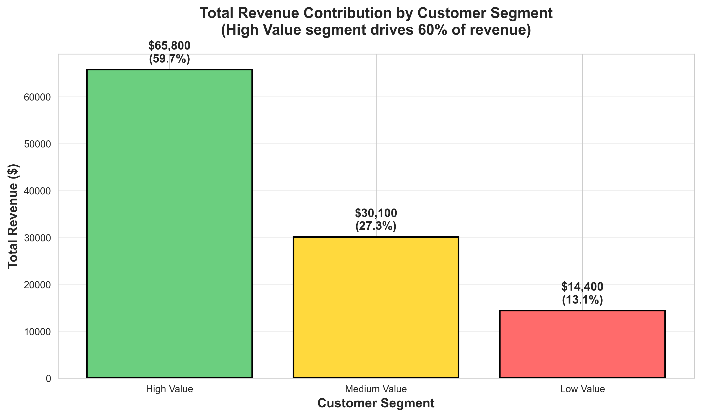
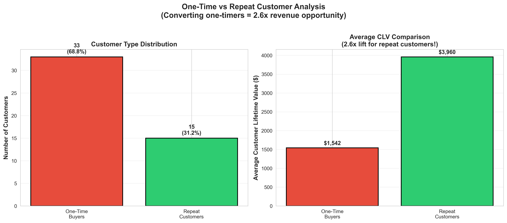

# Customer Insights Dashboard - End-to-End Data Analysis Project

)

## 📊 Project Overview

This project demonstrates a complete end-to-end data analysis workflow, transforming raw e-commerce data into actionable business insights through Python analysis and interactive Tableau dashboards.

**Key Achievement:** Identified $45,500 in at-risk revenue (41% of total) and discovered 2.6x CLV lift opportunity from converting one-time buyers to repeat customers.

## 🎯 Business Problem

An e-commerce company needed to:
- Understand customer value segmentation
- Identify at-risk high-value customers
- Analyze order completion and revenue trends
- Develop data-driven retention strategies

## 🛠️ Technologies Used

- **Python 3.12** - Data processing and analysis
- **Pandas & NumPy** - Data manipulation
- **Matplotlib & Seaborn** - Visualization
- **Tableau Public** - Interactive dashboard
- **Jupyter Notebook** - Analysis documentation

## 📁 Project Structure

```
customer-insights-pipeline/
│
├── customer_data_insight.ipynb          # Main analysis notebook
├── README.md                            # Project documentation
├── .gitignore                          # Git ignore rules
│
├── raw_data/                           # Original source data
│   ├── raw_customers.csv               # Customer master data (100 records)
│   ├── raw_orders.csv                  # Order transactions (99 records)
│   └── raw_payments.csv                # Payment details (113 records)
│
├── output_data/                        # Cleaned & processed datasets
│   ├── customer_insights_dashboard.csv # Main dashboard dataset (48 customers)
│   ├── monthly_performance.csv         # Time-series metrics (4 months)
│   ├── segment_analysis.csv            # Customer segmentation (3 segments)
│   ├── payment_method_analysis.csv     # Payment insights (4 methods)
│   ├── top_20_customers.csv            # VIP customer list (20 customers)
│   ├── order_status_breakdown.csv      # Order funnel (5 statuses)
│   ├── summary_statistics.csv          # Key metrics (20 KPIs)
│   └── data_dictionary.csv             # Field definitions
│
├── figures/                            # Generated visualizations
│   ├── 1_clv_distribution.png
│   ├── 2_top_10_customers.png
│   ├── 3_customer_segmentation.png
│   ├── 4_revenue_by_segment.png
│   ├── 5_order_status.png
│   ├── 6_payment_method_revenue.png
│   ├── 7_orders_revenue_correlation.png
│   └── 8_customer_behavior_comparison.png
│
├── tableau_dashboard/                  # Tableau files
│   ├── Customer_Insights_Dashboard.twbx # Packaged Tableau workbook
│   └── tableau_dashboard_screenshot.png # Dashboard preview
│
└── Business_Insights_Report.txt        # Comprehensive business report

```

## 📈 Key Findings

### Customer Segmentation
- **High Value** (16 customers, 33%): $65,800 revenue (59.7% of total)
- **Medium Value** (14 customers, 29%): $30,100 revenue (27.3%)
- **Low Value** (18 customers, 38%): $14,400 revenue (13.1%)

### Revenue Concentration (Pareto Analysis)
- Top 20% of customers generate **41.3% of revenue**
- Single top customer (Howard R.) contributes **9% of total revenue**
- High customer concentration = elevated business risk

### Customer Behavior
- **One-Time Buyers:** 33 customers (69%) - Average CLV: $882
- **Repeat Customers:** 15 customers (31%) - Average CLV: $2,953
- **CLV Lift:** 2.6x higher for repeat vs one-time buyers

### Operational Metrics
- **Order Completion Rate:** 67.7%
- **Return Rate:** 6.1%
- **Average CLV:** $2,297.92
- **Customers At Risk:** 40 (no purchase in 30+ days)

### Revenue Trends
- **January 2018:** $42,400 (82.8% completion)
- **February 2018:** $40,000 (96.3% completion)
- **March 2018:** $27,900 (48.6% completion)
- **April 2018:** $0 (0% completion - orders in progress)

## 🎨 Tableau Dashboard Features

### Interactive Visualizations
1. **KPI Cards:** 5 key metrics at a glance
2. **Revenue by Segment:** Pie chart showing value distribution
3. **Top 20 Customers:** Bar chart with revenue rankings
4. **Monthly Performance:** Dual-axis trend analysis
5. **Customer Type Analysis:** Stacked bar comparing segments
6. **Customer Matrix:** Scatter plot (orders vs revenue)
7. **At-Risk Alert:** Highlighted customers needing attention

### Dashboard Capabilities
- Filter by customer segment
- Drill-down into customer details
- Time-series trend analysis
- Interactive tooltips with customer names

## 💡 Business Recommendations

### 1. VIP Retention Program (Priority: CRITICAL)
**Target:** Top 10 customers ($45,500 revenue at risk)
- Dedicated account manager
- 15% loyalty discount
- Quarterly check-ins
- **Expected Impact:** Protect 41% of revenue stream

### 2. One-Time Buyer Conversion Campaign
**Target:** 33 one-time buyers
- "Welcome Back" 15% discount at Day 30
- Personalized product recommendations
- **Expected Impact:** $8,200-$11,500 additional revenue (Year 1)

### 3. At-Risk Customer Re-engagement
**Target:** 40 customers (>30 days inactive)
- Automated email sequence
- Exclusive "We miss you" offer
- **Expected Impact:** 25-30% reactivation rate

### 4. Payment Optimization
- Streamline credit card checkout (53% of revenue)
- Add Apple Pay / Google Pay
- **Expected Impact:** 10-15% reduction in cart abandonment

## 🚀 Getting Started

### Prerequisites
```bash
Python 3.12+
Tableau Desktop or Tableau Public
Git
```

### Installation

1. **Clone the repository:**
```bash
git clone https://github.com/yourusername/customer-insights-pipeline.git
cd customer-insights-pipeline
```

2. **Create virtual environment:**
```bash
python -m venv .venv
source .venv/bin/activate  # On Windows: .venv\Scripts\activate
```

3. **Install dependencies:**
```bash
pip install pandas numpy matplotlib seaborn jupyter
```

4. **Run the analysis:**
```bash
jupyter notebook customer_data_insight.ipynb
```

5. **Open Tableau Dashboard:**
- Open `tableau_dashboard/Customer_Insights_Dashboard.twbx` in Tableau
- Or view online: [Dashboard Link](your-tableau-public-link)

## 📊 Data Dictionary

| Field | Description | Use Case |
|-------|-------------|----------|
| customer_id | Unique customer identifier | Tracking individual customers |
| segment_label | Customer value tier (High/Medium/Low) | Targeted marketing campaigns |
| total_revenue | Customer lifetime value | VIP program eligibility |
| revenue_rank | Rank by total revenue | Identify top customers |
| is_top_20_pct | Top 20% revenue contributor flag | Priority account management |
| at_risk_flag | Inactive >30 days | Re-engagement campaigns |
| customer_type | One-Time or Repeat buyer | Retention strategy |
| days_since_last_order | Days since last purchase | Churn prediction |

## 📸 Screenshots

### Tableau Dashboard


### Python Visualizations



## 📝 Analysis Methodology

### Data Pipeline
1. **Extraction:** Load raw CSV files (customers, orders, payments)
2. **Cleaning:** Handle missing values, standardize formats
3. **Transformation:** Aggregate payments, calculate CLV metrics
4. **Segmentation:** Percentile-based value tiers (33rd, 67th)
5. **Analysis:** Statistical analysis, correlations, Pareto analysis
6. **Visualization:** 8 professional charts + Tableau dashboard
7. **Reporting:** Executive summary with actionable recommendations

### Key Calculations
- **Customer Lifetime Value (CLV):** Sum of all completed order values per customer
- **Customer Segments:** Based on revenue percentiles (0-33%, 33-67%, 67-100%)
- **At-Risk Flag:** Last order >30 days ago
- **CLV Lift:** Repeat customer avg CLV / One-time buyer avg CLV

## 🎓 Skills Demonstrated

- End-to-end data analysis workflow
- Data cleaning and validation
- Customer segmentation (RFM-style)
- Statistical analysis and correlation
- Business intelligence reporting
- Interactive dashboard design
- Data storytelling
- Git version control

## 📊 Results & Impact

### Financial Projections (12 Months)
- **Conservative (25% growth):** +$27,575 revenue, 212% ROI
- **Moderate (35% growth):** +$38,605 revenue, 250% ROI
- **Optimistic (50% growth):** +$55,150 revenue, 317% ROI

### Success Metrics
- Customer Lifetime Value: $2,298 → $2,872 (+25%)
- Repeat Purchase Rate: 31% → 45-50%
- Revenue from Top 20%: 41% → 60-65%

## 🤝 Contributing

Contributions, issues, and feature requests are welcome!

## 📫 Contact

**Your Name** - [LinkedIn](your-linkedin) - [Email](your-email)

**Portfolio:** [yourwebsite.com](https://yourwebsite.com)

## 📄 License

This project is licensed under the MIT License - see the LICENSE file for details.

## 🙏 Acknowledgments

- Dataset inspired by dbt's Jaffle Shop demo
- Analysis framework based on e-commerce best practices
- Tableau Public for hosting interactive dashboards

---

⭐ **Star this repo if you found it helpful!**

🔗 **Live Dashboard:** [View on Tableau Public](your-tableau-link)

📧 **Questions?** Open an issue or reach out!


